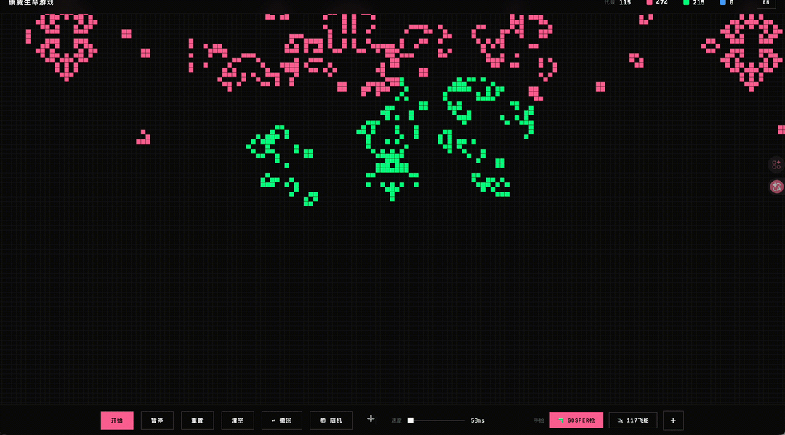

# Life Battle — Conway's Game of Life, but as a Multi-Species Battle

> Conway's Game of Life with **multiple species (colors) competing on the same grid**.
> Watch gliders, spaceships and puffer trains fight for territory — and discover whether
> your opening formation can survive the chaos.

<p align="center">
  <a href="https://static.feishare.net/auto_cell_battle/">
    <strong>▶ Play the live demo</strong>
  </a>
  &nbsp;·&nbsp;
  <a href="#game-rules">Rules</a>
  &nbsp;·&nbsp;
  <a href="#pattern-library">Patterns</a>
  &nbsp;·&nbsp;
  <a href="#other-modes">Other modes</a>
</p>

<p align="center">
  
</p>

---

## Why this exists

The classic [Game of Life](https://en.wikipedia.org/wiki/Conway%27s_Game_of_Life)
is mesmerizing but solitary — every cell is just "alive" or "dead". I wanted to
see what happens when **cells belong to teams**. So I extended Conway's two
rules with one tiny addition:

> **When a new cell is born from 3 neighbors, it inherits the majority team's color.**

That single change turns the simulation into a battlefield. A Gosper glider
gun pointing at an enemy spaceship factory. Three penguins squaring off against
a puffer train. A pulsar slowly eaten by acorns. None of these "should" happen
in the original Life — but here they do, and the outcomes are surprisingly
hard to predict.

## Features

- 🎨 **2–4 species** on one grid, color-coded (pink / green / blue / white)
- 🔫 **16 classic patterns** as starter armies: glider, Gosper Gun, R-pentomino,
  spaceships (LWSS/HWSS/Copperhead/117P9), pulsar, acorn, diehard, eater, puffer train, plus 6 custom animal shapes
- ✏️ **Free-form drawing** with race selector — paint your own army
- ⏪ **20-step undo** for experimentation
- ⚡ **Speed control** (1–60 generations/sec)
- 📱 **Mobile-friendly** responsive layout
- 🌐 **Bilingual UI** (中文 / English)
- 🪶 **Zero dependencies** — single HTML + 3 JS files, total ~1700 lines, runs anywhere

## Quick start

```bash
# Just open the file — no build, no install
open auto_cell_battle/index.html

# Or serve over HTTP if you prefer
python3 -m http.server 8000
# then visit http://localhost:8000/auto_cell_battle/
```

## Game rules

The standard Life rules, plus one inheritance rule:

| Cell state | Live neighbors | Next generation |
|---|---|---|
| Alive (any team) | 2 or 3 | Stays alive, **keeps its team** |
| Alive (any team) | < 2 or > 3 | Dies |
| Dead | Exactly 3 | **Born into the majority team** among those 3 neighbors |

When all 3 neighbors come from different teams (1+1+1), the cell stays dead — no consensus, no birth.

## Pattern library

Click the pattern button to spawn famous Life patterns as either team's color:

**Classic Life patterns**
- 🔫 Gosper Glider Gun — emits a glider every 30 generations
- 🛩️ 117P9 Spaceship — c/3 speed, 117 cells
- 🚢 HWSS (Heavyweight Spaceship)
- 🐍 Copperhead — slow, exotic spaceship
- 💫 Pulsar — period-3 oscillator
- 🌰 Acorn — explodes into 633 cells over 5206 generations
- 🌱 R-pentomino — stabilizes after 1103 generations
- 💀 Diehard — lives 130 generations before vanishing
- 🍽️ Eater — pattern that "eats" gliders
- 🚂 Puffer Train — leaves debris as it moves
- 🍲 Random Soup — 20×20 chaos starter

**Custom animal patterns** (designed for this project)
- 🐰 Rabbit, 🐱 Cat, 🐶 Dog, 🐧 Penguin, 🦎 Lizard, 🐢 Turtle

## Project layout

```
auto-cell/
├── auto_cell_battle/      ← Multi-species battle mode (the main attraction)
├── auto_cell_single/      ← Classic single-species Life (vanilla)
├── auto_cell_multi/       ← Multi-species without the battle UI
├── auto_cell_hex/         ← Hexagonal grid variant (experimental)
├── auto_cell_tri/         ← Triangular grid variant (experimental)
├── auto_cell_3d/          ← 3D grid (experimental)
├── auto_cell_rabbit/      ← Standalone "rabbit" pattern explorer
└── docs/
```

## Other modes

These are alternative grid topologies I've been experimenting with. The Life
rules are not strictly portable — neighborhood definitions and birth/survive
thresholds need re-tuning per topology. Treat them as visual experiments
rather than canonical Life.

| Mode | Demo |
|---|---|
| Battle (recommended) | https://static.feishare.net/auto_cell_battle/ |
| Single species | https://static.feishare.net/auto_cell_single/ |
| Multi species | https://static.feishare.net/auto_cell_multi/ |
| Hex grid | https://static.feishare.net/auto_cell_hex/ |
| Triangle grid | https://static.feishare.net/auto_cell_tri/ |
| 3D grid | https://static.feishare.net/auto_cell_3d/ |

## Tech notes

- **No framework**, no build step, no npm. Plain HTML + Canvas 2D + vanilla JS (ES2017+).
- The battle mode uses a single `MultiGrid` class storing cell **team IDs** (0 = dead, 1–4 = teams) instead of booleans.
- Patterns are loaded from a small RLE parser (Gosper Gun, 117P9 Ship are in standard [RLE format](https://www.conwaylife.com/wiki/Run_Length_Encoded)); custom animal patterns use a simpler `[dx, dy]` relative-coordinate list.
- Performance: a 192×108 grid (laptop full-screen) runs at 60 fps in Chrome on a 2021 M1 MacBook Pro.

## Contributing

PRs welcome. Ideas I'd love help with:

- [ ] More patterns from [LifeWiki](https://conwaylife.com/wiki/Main_Page) (especially guns and reflectors)
- [ ] A **tournament mode**: 64-pattern bracket, last team standing wins
- [ ] Replay export (save the seed + a few frames → reproduce the battle)
- [ ] WebGL renderer for grids above 500×500
- [ ] A "discover patterns" mode that surfaces what your random soup evolves into

## Acknowledgments

- John Conway (1937–2020), who invented the rules in 1970
- The [LifeWiki](https://conwaylife.com/wiki/Main_Page) community, where most of the classic patterns come from
- Bill Gosper, who built the [first glider gun](https://www.conwaylife.com/wiki/Gosper_glider_gun) in 1970 — the inspiration for the "🔫" button in this project

## License

[MIT](LICENSE) — do whatever you want, just keep the notice.

---

<p align="center">
  If you have fun with it, a ⭐ goes a long way.
</p>
